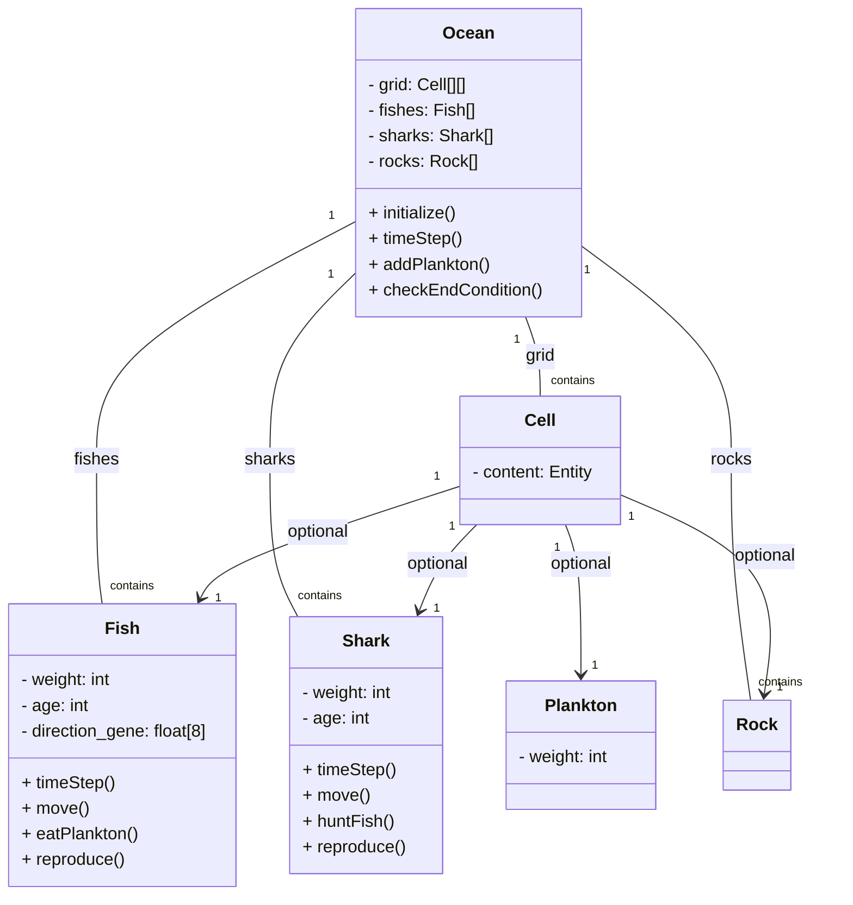

```mermaid
classDiagram
    class Ocean {
        - grid: Cell[][]
        - fishes: Fish[]
        - sharks: Shark[]
        - rocks: Rock[]
        + initialize()
        + timeStep()
        + addPlankton()
        + checkEndCondition()
    }
    
    class Cell {
        - content: Entity
    }

    class Fish {
        - weight: int
        - age: int
        - direction_gene: float[8]
        + timeStep()
        + move()
        + eatPlankton()
        + reproduce()
    }

    class Shark {
        - weight: int
        - age: int
        + timeStep()
        + move()
        + huntFish()
        + reproduce()
    }

    class Plankton {
        - weight: int
    }

    class Rock {
    }

    Ocean "1" -- "contains" Cell : grid
    Ocean "1" -- "contains" Fish : fishes
    Ocean "1" -- "contains" Shark : sharks
    Ocean "1" -- "contains" Rock : rocks
    Cell "1" --> "1" Fish : optional
    Cell "1" --> "1" Shark : optional
    Cell "1" --> "1" Plankton : optional
    Cell "1" --> "1" Rock : optional
```