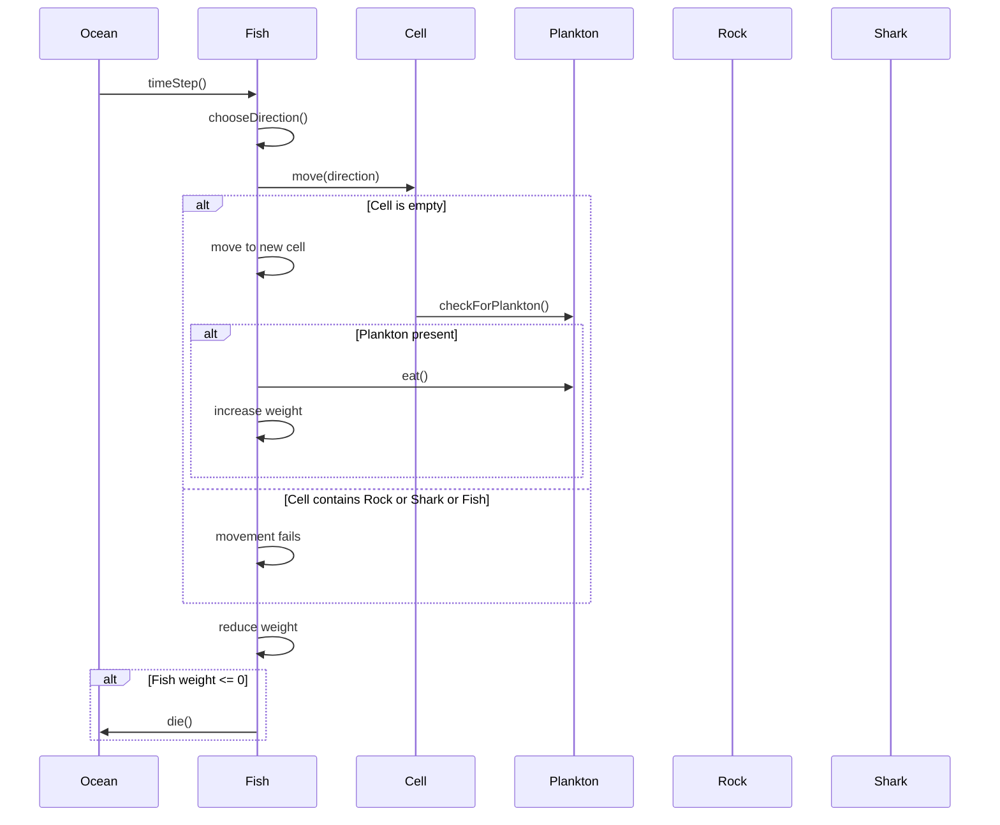

```mermaid
sequenceDiagram
    participant Ocean
    participant Fish
    participant Cell
    participant Plankton
    participant Rock
    participant Shark

    Ocean->>Fish: timeStep()
    Fish->>Fish: chooseDirection()
    Fish->>Cell: move(direction)
    alt Cell is empty
        Fish->>Fish: move to new cell
        Cell->>Plankton: checkForPlankton()
        alt Plankton present
            Fish->>Plankton: eat()
            Fish->>Fish: increase weight
        end
    else Cell contains Rock or Shark or Fish
        Fish->>Fish: movement fails
    end
    Fish->>Fish: reduce weight
    alt Fish weight <= 0
        Fish->>Ocean: die()
    end

```