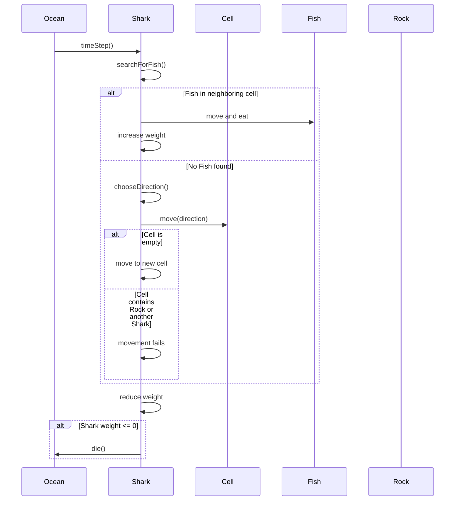

```mermaid
sequenceDiagram
    participant Ocean
    participant Shark
    participant Cell
    participant Fish
    participant Rock

    Ocean->>Shark: timeStep()
    Shark->>Shark: searchForFish()
    alt Fish in neighboring cell
        Shark->>Fish: move and eat
        Shark->>Shark: increase weight
    else No Fish found
        Shark->>Shark: chooseDirection()
        Shark->>Cell: move(direction)
        alt Cell is empty
            Shark->>Shark: move to new cell
        else Cell contains Rock or another Shark
            Shark->>Shark: movement fails
        end
    end
    Shark->>Shark: reduce weight
    alt Shark weight <= 0
        Shark->>Ocean: die()
    end

```